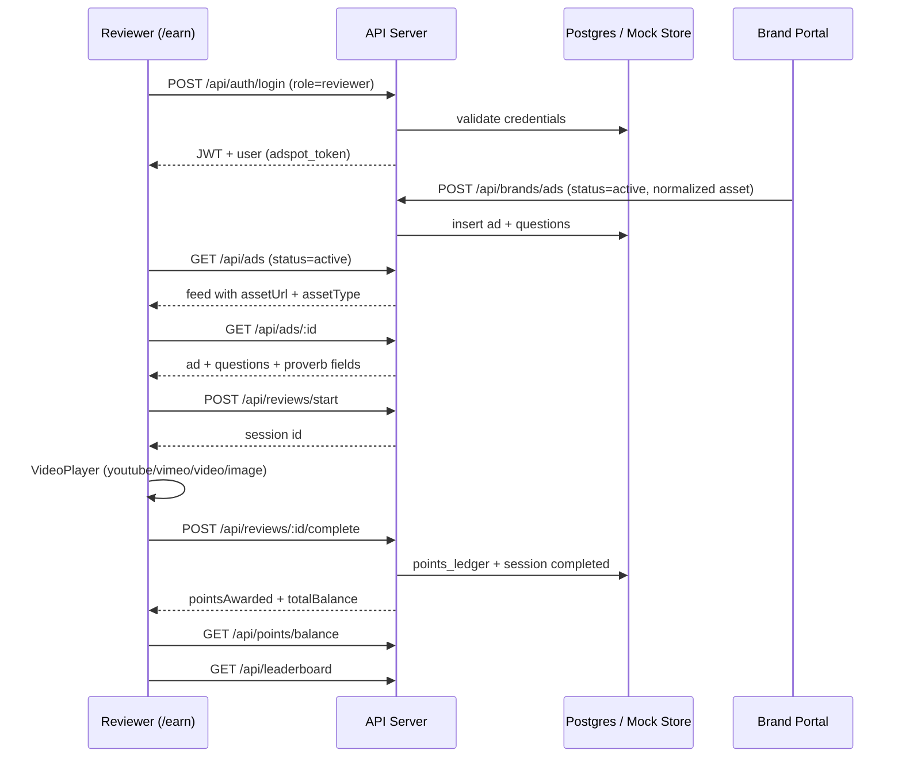

# AdSpot Reviewer Pipeline Fix — 5 Aug 2026

End-to-end trace of the reviewer flow and fixes applied for testing report items **ADS07**, **ADS09**, **ADS12**, **ADS13**.

## Pipeline diagram



## Issue → fix mapping

| ID | Symptom | Root cause | Fix |
|----|---------|------------|-----|
| **ADS07** | Campaign opens with no video; no points on correct answer | Mock questions used invalid `mcq` type (UI only renders `multiple_choice`); mock mode had no `/reviews/:id/complete` handler; proverb bonus never wired | `multiple_choice` in mock store; `completeMockReview()`; proverb UI + server bonus scoring |
| **ADS09** | Admin login lands on brand dashboard | Login relied on async `useEffect` redirect after `setAuth` | Immediate role-based `setLocation` in `onSuccess` |
| **ADS12** | Brand cannot delete ads | No DELETE route or UI | `DELETE /api/brands/ads/:adId` (hard delete or archive); delete buttons in MyAds + AdDetail |
| **ADS13** | Brand-created ads missing from reviewer feed | New ads created as `draft`; YouTube URLs stored as `video` type | Create with `status: active`; `normalizeAdAsset()` detects YouTube/Vimeo |

## Files changed

| Area | Files |
|------|-------|
| Mock reviewer | `server/src/lib/reviewer-mock-store.ts` |
| Review API | `server/src/routes/reviews.ts`, `server/src/routes/ads.ts` |
| Brand ads | `server/src/routes/brands.ts`, `server/src/lib/asset-normalize.ts` |
| Validation | `server/src/middlewares/validate.ts` |
| Reviewer UI | `app/src/earn/pages/ReviewSession.tsx` |
| Brand UI | `app/src/brands/pages/Login.tsx`, `CreateAd.tsx`, `MyAds.tsx`, `AdDetail.tsx` |
| Asset helpers | `app/src/lib/adAssetNormalize.ts` |
| Local media | `server/src/lib/local-object-storage.ts`, `server/src/routes/storage.ts` |
| Audit / E2E | `scripts/hostile-audit.mjs`, `scripts/test-reviewer-flow.mjs` |

## Verification

```bash
pnpm install   # applies zod dedupe override
pnpm run build
node scripts/hostile-audit.mjs --mock-only --skip-install --force-mock
# With server running (AUDIT_PARTNER_MOCK=1):
node scripts/test-reviewer-flow.mjs http://127.0.0.1:3001
```

### Video upload + serving (local dev)

When `PRIVATE_OBJECT_DIR` is unset, uploads land in `server/.data/uploads/` and are served at `/api/storage/objects/uploads/<file>`. Brand create forms store the full URL; `normalizeAdAsset()` classifies these as `video` or `image` for the reviewer player.

### Manual reviewer checklist

1. `/earn/login` → `alice@reviewer.demo` / `password123` → `/earn/dashboard`
2. Open campaign → YouTube/video renders in player
3. Watch timer → answer questions + attention check → submit
4. Points increase on dashboard; leaderboard shows entry
5. Brand: create campaign → appears on reviewer feed immediately
6. Brand: delete campaign from My Ads or Ad Detail
7. Admin: `admin@adspot.demo` → `/brands/admin/dashboard` (not brand dashboard)

## Session isolation

| Portal | Token key | Role gate |
|--------|-----------|-----------|
| `/earn/*` | `adspot_token` | `reviewer` only |
| `/brands/*` | `adspot_brand_token` | `brand`, `admin`, `super_admin` |

Cross-portal login attempts show a clear error and redirect to the correct portal.
